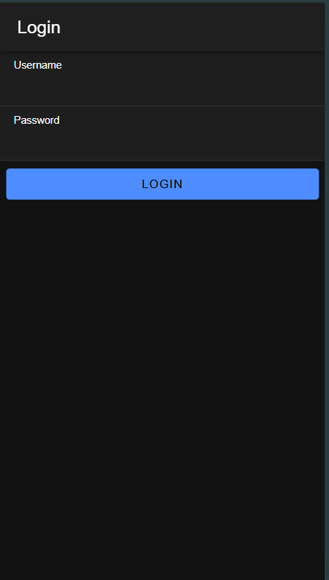
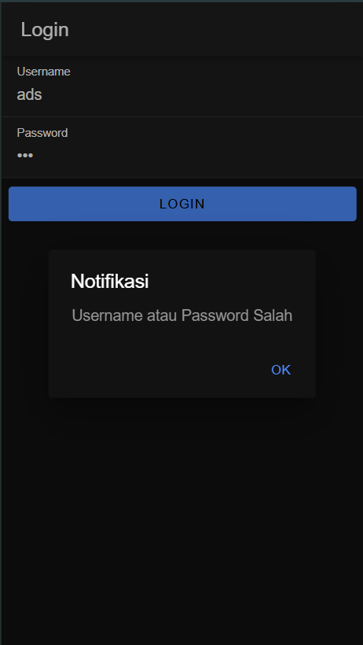
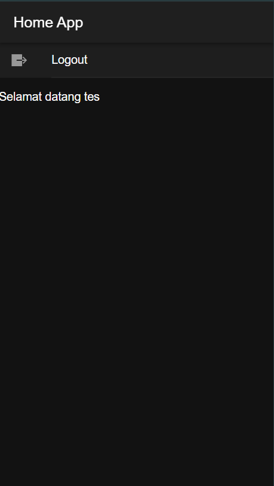

Berikut adalah penjelasan tentang cara kerja fitur login pada aplikasi Ionic yang menggunakan Angular:

## Cara Kerja Login

Fitur login dalam aplikasi ini menggunakan Angular dan Ionic untuk membuat interaksi dengan API serta penyimpanan token autentikasi menggunakan `Preferences` dari Capacitor. Berikut adalah langkah-langkah utama dalam proses login:

1. **Konfigurasi Module Utama**
   - Pada `app/app.module.ts`, aplikasi diatur untuk menyediakan `provideHttpClient` agar dapat melakukan komunikasi HTTP ke API.

2. **Penyimpanan Token Autentikasi**
   - `authentication.service.ts` mengatur autentikasi pengguna. Saat login berhasil, token dan informasi pengguna akan disimpan menggunakan `Preferences.set`, yang menyimpan data di penyimpanan lokal perangkat. Token disimpan dengan kunci `auth-login` dan nama pengguna dengan kunci `auth-user`.

3. **Pengaturan Status Autentikasi**
   - `isAuthenticated` adalah `BehaviorSubject` yang mengawasi status autentikasi pengguna. Nilai awalnya adalah `false`, namun setelah login berhasil, nilai ini berubah menjadi `true`, yang berarti pengguna sudah terautentikasi.
   - Ketika aplikasi diinisialisasi, metode `loadData()` memeriksa penyimpanan lokal untuk token dan informasi pengguna. Jika ditemukan, status autentikasi akan disetel ke `true`.

4. **Proses Login di Halaman Login**
   - Pada `login.page.html`, pengguna memasukkan username dan password, lalu menekan tombol "Login".
   - Saat tombol ditekan, fungsi `login()` pada `login.page.ts` akan dipanggil. Fungsi ini membuat objek data yang berisi `username` dan `password`.
   - Data ini dikirimkan ke API endpoint `login.php` dengan metode POST menggunakan `postMethod` dari `AuthenticationService`.
   - Jika respon dari API menunjukkan bahwa status login berhasil, maka:
     - Token dan username dari respon API akan disimpan menggunakan `saveData()`.
     - `username` dan `password` direset, dan pengguna dialihkan ke halaman `/home`.
   - Jika login gagal, notifikasi akan ditampilkan menggunakan metode `notifikasi()`.

5. **Penggunaan Guard untuk Akses Terproteksi**
   - Pada `auth.guard.ts`, terdapat guard `authGuard` yang digunakan untuk melindungi halaman `/home`. Guard ini akan memeriksa status autentikasi sebelum pengguna diizinkan mengakses halaman.
   - Jika status autentikasi `false`, pengguna dialihkan ke halaman `/login`.
   - Guard lain, `autoLoginGuard` pada `auto-login.guard.ts`, memastikan pengguna yang sudah terautentikasi tidak kembali ke halaman login dan dialihkan langsung ke halaman `/home`.

6. **Logout**
   - Pada `home.page.ts`, terdapat metode `logout()` yang memanggil `logout()` dari `AuthenticationService`. Metode ini akan menghapus token dan username dari penyimpanan lokal, mengatur status autentikasi ke `false`, dan mengarahkan pengguna kembali ke halaman `/login`.

